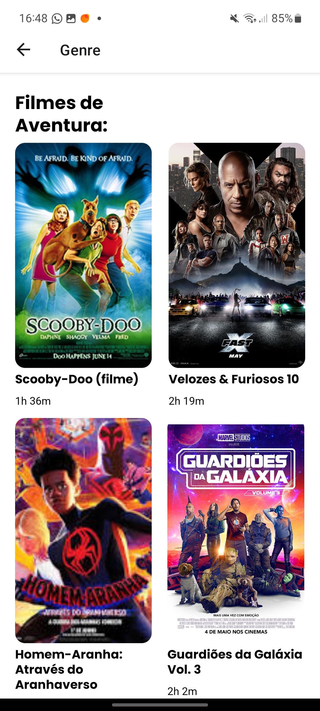

# 📽️ Cinemais - Mobile

Manage movie theaters and film screenings in practical and digital way!

<p align="center">
  
  <span>Project Interface</span>
</p>

<p align="center">
  
  
  
</p>

## 📂 Boilerplate

This project was bootstrapped with [Expo](https://docs.expo.dev/tutorial/create-your-first-app/).

## 💻 Technologies

* [Node](https://nodejs.org/en/)
* [React](https://reactjs.org/)
* [Expo](https://expo.dev/)

## 📸 Screenshots

<p align="center">
  <table>
    <tr>
      <td>
        
      </td>
      <td>
        
      </td>
      <td>
        
      </td>
      <td>
        
      </td>
    </tr>
  </table>
</p>

## 🏃 Getting Started

First, clone this repository and access the created folder:

```bash
# Cloning repository
git clone https://github.com/iamtheluiz/cinemais-app.git

cd cinemais-app/
```

Inside the folder, install all project dependencies:

```bash
npm install
# or
yarn install
```

## 👨🏽‍💻 Usage

To run this project in a local environment use:

```bash
npm run start
# or
yarn start
```

You need to download the [Expo](https://play.google.com/store/apps/details?id=host.exp.exponent&hl=pt_BR&gl=US) app on your smartphone and scan the QR Code that will appear on the screen.

## 💼 Authors

* **Luiz Gustavo** - *Development* - [iamtheluiz](https://github.com/iamtheluiz)
  * Website: https://iamtheluiz.github.io
  * Github: [@iamtheluiz](https://github.com/iamtheluiz)
  * LinkedIn: [Luiz Gustavo da Silva Vasconcellos](https://www.linkedin.com/in/luiz-gustavo-da-silva-vasconcellos-05192a192?lipi=urn%3Ali%3Apage%3Ad_flagship3_profile_view_base_contact_details%3BbQkVQ3sTTv6XCn%2FiToGGcA%3D%3D)

<!-- ## 📃 License

This project is under the MIT License - see the [LICENSE](LICENSE) file for details. -->
